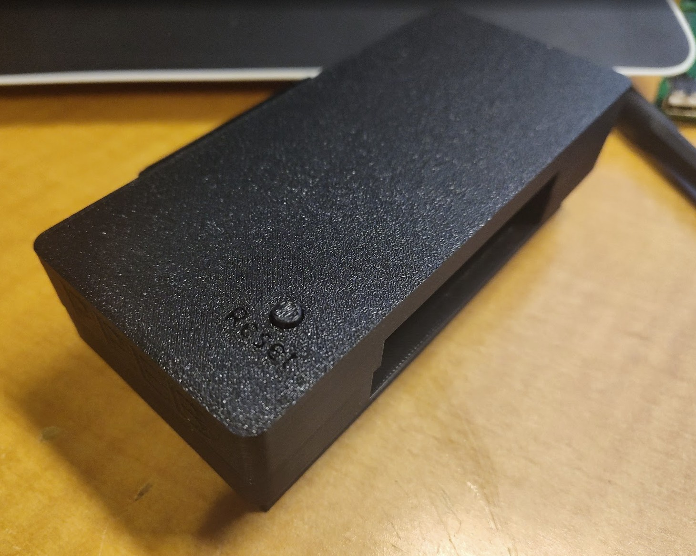
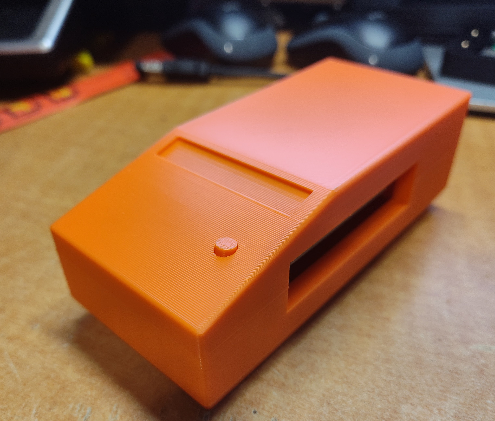
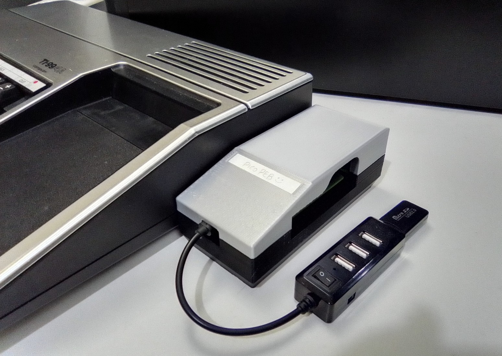

# PPEB Cases
*Works in progress*

PPEBcr Cases (SMD Version)

- [dabone-ppebcr (Easy to print, no supports needed, uses M3 nuts or M3 Inserts)](#dabone-case)
- [JasonACT-ppebcr Remix (Supports needed, uses M3 Screws or M3 Inserts)](#jason-cr-case)

PPEB Original Version

- [JasonACT Case (Supports needed, uses M3 Screws or M3 Inserts)](#jason-case)

## dabone-ppebcr 

## JasonACT ppebcr Remix 

## JasonACT Original PCB Case 

  
   

## [Back to Main Guide](/README.md)